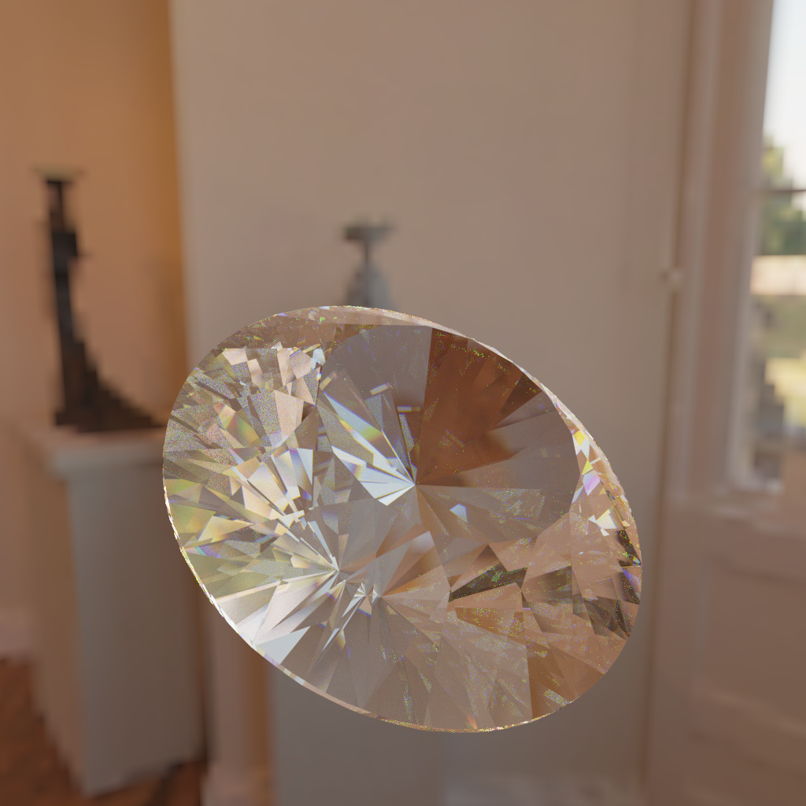

# Material system

The material system is built around the [alias/wavefront material](http://paulbourke.net/dataformats/mtl) 
format with a few extensions for accessing the advanced rendering features
offered by polaris.

# Supported attributes of the mtl format

When polaris encounters a material without a material expression it will make 
a best-effort attempt to construct one by analyzing any present mtl format 
attributes. The following attributes of the wavefront material format are recognized
by the material parser:

| Attribute | Description         | Value type | Example                | Notes
|-----------|---------------------|------------|------------------------|------------
| Kd        | Diffuse  color      | Vector     | `Kd 0.9 0.1 0.1`       | Vector components should be in the `[0, 1)` range
| Ks        | Specular color      | Vector     | `Ks 1 1 1`             | Vector components should be in the `[0, 1)` range
| Tf        | Transmittance color | Vector     | `Tf 0.9 0 0`           | Vector components should be in the `[0, 1)` range
| Ke        | Emissive color      | Vector     | `Ke 10 10 10`          | No limit for emissive components
| map\_Kd   | Diffuse  texture    | String     | `map_Kd "foo.jpg"`     | 
| map\_Ks   | Specular texture    | String     | `map_Ks "foo.png"`     | 
| map\_Tf   | Transmittance texture | String   | `map_Tf "foo.tga"`     | 
| map\_Ke   | Emissive texture    | String     | `map_Ke "foo.exr"`     | An exr/hdr file can be used for HDR rendering
| map\_bump | Bumpmap texture     | String     | `map_bump "stones-b.png"`|
| Ni        | Refractive Index    | Scalar     | `Ni 1.53`              |

Polaris uses [OpenImageIO](https://github.com/OpenImageIO/oiio) for loading image 
files. This allows the renderer to parse most known image formats including
openEXR and HDR/RGBE for HDR renders.

# Extensions to the mtl format

In addition to the standard mtl attributes described above, polaris also 
supports the following attribute extensions:

| Attribute   | Description                                  | Value type | Example                 | Notes
|-------------|----------------------------------------------|------------|-------------------------|------------
| include     | Include properties from an existing material | String     | `include "glass"`       | This attribute can be used to extend an existing material and overwrite one or more of its attributes
| KeScaler    | Scaler value for emissive texture            | Scalar     | `KeScaler 3.0`          | This attribute allows you to specify a 24-bit RGB emissive texture and apply a scaler to its RGB values. It's an alternative way to enable HDR rendering when exr/hdr files cannot be used
| map\_normal | Normal map texture                           | String     | `map_normal "stones-n.png"`|
| mat\_expr   | Define material expression                   | String     | `mat_expr diffuse(reflectance: {0.9, 0.0})` | See [material expressions](#material-expressions) following section for more details

When specifying a path to a texture or other external resource:
- A relative path (to the current file) can be used
- An absolute path can be used 
- An http/https URL can be specified to pull the resource from a remote host

# Reserved material names 

The scene compiler recognizes two reserved material names that can be defined 
to override global scene properties:

- `scene_diffuse_material`: specifies the diffuse material for the scene background.
If defined, this material will be sampled by rays that do not intersect any of the 
scene geometry. It can be used to specify a lat/lng skypbox envmap. If not defined,
it defaults to a black diffuse surface.
- `scene_emissive_material`: specifies a global emissive material that simulates 
a directional light. By default its not used but it can be specified to enable 
a HDR emissive env map.

# Material expressions

Material expressions can be used to specify layered materials, that is, materials 
that either use a specific BxDF surface model or combine multiple surface models 
using one or more operators.

## Sampling layered materials 

Polaris uses a very simple approach to sampling layered materials. When its time 
to evaluate a material for a ray intersection it will traverse the layered material 
tree applying any operators it encounters till it hits a leaf node which is 
then selected as the surface material.

For more info on layered materials and how they are sampled you can skim through
this very interesting [presentation](http://www.slideshare.net/takahiroharada/introduction-to-monte-carlo-ray-tracing-cedec2013)
by Takahiro Harada.

## BxDF models

### diffuse

This model simulates a smooth lambertian surface. This model supports the 
following parameters:

| Parameter name | Description   | Type              | Default | Example 
|----------------|---------------|-------------------|---------|-----------
| reflectance    | diffuse value | Vector OR texture | {0.2,0.2,0.2} | `reflectance: {0.9,0,0}` `reflectance: "stones-d.jpg"`

Examples:

| Expression                                                              | Output 
|-------------------------------------------------------------------------|----------------
| `diffuse(reflectance: {0.999, 0, 0})`                                   | 
| `diffuse(reflectance: "stones-d.png")`                                  | 

### conductor

This model simulates a smooth conductor. This model supports the following parameters:

| Parameter name | Description    | Type                | Default | Example 
|----------------|----------------|---------------------|---------| ------------
| specularity    | specular value | Vector OR texture   | {1,1,1} | `specularity: {0.9,0,0}` `specularity: "stones-s.jpg"`
| intIOR         | internal IOR   | Scalar OR mat. name | "glass" | `intIOR: 1.345` `intIOR: "diamond"`
| extIOR         | external IOR   | Scalar OR mat. name | "air"   | `extIOR: 1` `extIOR: "air"`

Examples:

| Expression                                                               | Output 
|--------------------------------------------------------------------------|----------------
|`conductor(intIOR: "gold", specularity: {1.0, 0.766, 0.336})`             | 
|`conductor(intIOR: "silver", specularity: {0.971519, 0.959915, 0.91532})` | 
|`conductor(specularity: "checkerboard-bw.jpg")`                           | 

### dielectric

This model simulates an ideal dielectric material where the fresnel factor is 
used to select whether a ray will get reflected or refracted. When rendering
complex geometry using dielectrics it is advised to increase the number of
ray bounces. This model supports the following parameters:

| Parameter name | Description    | Type                | Default | Example 
|----------------|----------------|---------------------|---------| ------------
| specularity    | specular value | Vector OR texture   | {1,1,1} | `specularity: {0.9,0,0}` `specularity: "stones-s.jpg"`
| transmittance  | transmittance  | Vector OR texture   | {1,1,1} | `transmittance: {0.9,0,0}` `transmittance: "logo-t.jpg"`
| intIOR         | internal IOR   | Scalar OR mat. name | "glass" | `intIOR: 1.345` `intIOR: "diamond"`
| extIOR         | external IOR   | Scalar OR mat. name | "air"   | `extIOR: 1` `extIOR: "air"`

Examples:

| Expression                                                               | Output 
|--------------------------------------------------------------------------|----------------
|`dielectric(intIOR: "glass")`                                             | 
|`dielectric(intIOR: "glass", specularity: {0.04, 0.04, 0.04}, transmittance: {0.5, 0, 0.9})`  | 
|`dielectric(intIOR: "glass", specularity: "checkerboard-blue.jpg")`       | 
|`dielectric(intIOR: "glass", transmittance: "checkerboard-blue.jpg")`     | 

### roughConductor

This model simulates a rough conductor. It uses the BRDF formula described in 
[microfacet models for refraction through rough surfaces](https://www.cs.cornell.edu/~srm/publications/EGSR07-btdf.pdf).
This model supports the following parameters:

| Parameter name | Description    | Type                | Default | Example 
|----------------|----------------|---------------------|---------| ------------
| specularity    | specular value | Vector OR texture   | {1,1,1} | `specularity: {0.9,0,0}` `specularity: "stones-s.jpg"`
| intIOR         | internal IOR   | Scalar OR mat. name | "glass" | `intIOR: 1.345` `intIOR: "diamond"`
| extIOR         | external IOR   | Scalar OR mat. name | "air"   | `extIOR: 1` `extIOR: "air"`
| roughness      | roughness factor| Scalar OR texture  | 0.1     | `roughness: 0.5` `roughness: "stones-r.jpg" 

The following examples illustrate how the same material looks with different roughness values:

| Expression                                                                       | Output 
|----------------------------------------------------------------------------------|----------------
|`roughConductor(intIOR: "gold", specularity: {1.0, 0.766, 0.336}, roughness:0.1)` | 
|`roughConductor(intIOR: "gold", specularity: {1.0, 0.766, 0.336}, roughness:0.25)`| 
|`roughConductor(intIOR: "gold", specularity: {1.0, 0.766, 0.336}, roughness:0.5)` | 
|`roughConductor(intIOR: "gold", specularity: {1.0, 0.766, 0.336}, roughness:0.75)`| 

### roughDielectric

This model simulates a rough dielectric material. It uses the BRDF and BTDF 
formulas described in [microfacet models for refraction through rough surfaces](https://www.cs.cornell.edu/~srm/publications/EGSR07-btdf.pdf)
as well as the fresnel factor to select between ray reflection and refraction.

This model supports the following parameters:

| Parameter name | Description    | Type                | Default | Example 
|----------------|----------------|---------------------|---------| ------------
| specularity    | specular value | Vector OR texture   | {1,1,1} | `specularity: {0.9,0,0}` `specularity: "stones-s.jpg"`
| transmittance  | transmittance  | Vector OR texture   | {1,1,1} | `transmittance: {0.9,0,0}` `transmittance: "logo-t.jpg"`
| intIOR         | internal IOR   | Scalar OR mat. name | "glass" | `intIOR: 1.345` `intIOR: "diamond"`
| extIOR         | external IOR   | Scalar OR mat. name | "air"   | `extIOR: 1` `extIOR: "air"`
| roughness      | roughness factor| Scalar OR texture  | 0.1     | `roughness: 0.5` `roughness: "stones-r.jpg"` 

| Expression                                                                       | Output 
|----------------------------------------------------------------------------------|----------------
|`roughDielectric(intIOR: "glass", specularity: {0.9, 0.9, 0.9}, roughness: 0.2)`  | 
|`roughDielectric(intIOR: "glass", roughness: "earth-r.jpg")`                      | 

## emissive

This model describes a surface that emits light. It supports the following parameters:

| Parameter name | Description            | Type                | Default | Example 
|----------------|------------------------|---------------------|---------| ------------
| radiance       | emitted radiance value | Vector OR texture   | {1,1,1} | `radiance: {5,5,5}` `radiance: "spot.jpg"`

## Operators

Operators are special functions that either modify or combine their operands.
Their operands are either another nested operator or a bxdf surface definition.
In addition, expression operands may also reference other materials **by name**.
For example:

```mtl
newmtl gold
  mat_expr conductor(intIOR: "gold", specularity: {1.0, 0.766, 0.336})

newmtl silver
  mat_expr conductor(intIOR: "silver", specularity: {0.971519, 0.959915, 0.915324})

newmtl weird
  mat_expr mixMap("gold", "silver", "checkerboard-bw.jpg")
```

### mix

The mix operator accepts two expression operands `A` and `B` and a weight `W` in the `[0,1]`
range. 

When sampling this operator, a random value is used to select either 
`A` or `B` based on the weights (`A` chosen with probablity `W` and `B` chosen 
with probability `1-W`).

Examples:

| Example                                                                          | Output     
|----------------------------------------------------------------------------------|------------
| `mix(diffuse(reflectance: {0.999,0,0}), diffuse(reflectance: {0,0,0.999}), 0.5)` | 
| `mix(diffuse(reflectance: "stones-d.jpg"), conductor(intIOR: "silver", specularity: {0.971519, 0.959915, 0.91532}), 0.6)` | 

### mixMap

The mix operator accepts two expression operands `A` and `B` and a single channel texture 
containing a per-pixel sampling weight.

When sampling this operator, the weight `W` is sampled from the weight texture 
using the UV coordinates of the surface intersection and a random value is used 
to select either `A` or `B` based on the weights (`A` chosen with probablity 
`W` and `B` chosen with probability `1-W`).

Examples:

| Example                         | Output     |
|---------------------------------|------------
| `mix(conductor(intIOR: "gold", specularity: {1.0, 0.766, 0.336)), conductor(intIOR: "silver", specularity: {0.971519, 0.959915, 0.91532}), 0.6), "checkerboard-bw.jpg")`| 

### bumpMap

This is a pass-through operator that modifies the normal of the surface intersection 
point using an image. It accepts an expression operand and a texture argument.

Bump maps are single-channel grayscale images and polaris needs to reconstruct
the bi-tangent vectors from by fetching 3 samples from the bumpmap texture. It
is usually faster to use a [normal map](#normalmap) instead.

| Example                                                         | Bump map | Output     
|-----------------------------------------------------------------|----------|------------
| `bumpMap(diffuse(reflectance: "stones-d.png"), "stones-b.png")` |  | 

### normalMap

This is a pass-through operator that modifies the normal of the surface intersection 
point using an image. It accepts an expression operand and a texture argument.

Normal maps are RGB images where each component specifies an offset for the X, Y and 
~ coordinates. This operator achieves the same result as the [bumpMap](#bumpmap)
operator but it is a bit faster to evaluate.

| Example                                                           | Normal map | Output     
|-------------------------------------------------------------------|------------|----------
| `normalMap(diffuse(reflectance: "stones-n.png"), "stones-b.png")` |  | 

### disperse 
The disperse operator is used to simulate [light dispersion](https://en.wikipedia.org/wiki/Dispersion_(optics))
inside dielectric materials where essentially, rays exhibit a slightly different
IOR based on their wavelength. 

This operator accepts an expression operand and two vectors (one for the internal 
and one for the external IOR) with IOR values for the R, G and B channels. Unless
rendering a scene where light passes through dielectric materials (eg. glass filled with water),
the extIOR vector can be set to `{0,0,0}` which effectively makes polaris ignore it
and just use whatever value the leaf node defines for extIOR.

A correct approximation of dispersion would require a tracer capable of performing
spectral rendering. Polaris simulates dispersion using different IORs for the R, G and B
channels.

Whenever the dispersion operator is evaluated, we first check the path flags to 
detect whether some ray has undergone dispersion somewhere along the path. If 
this is the first time that the path will get dispersed then we randomly select 
a channel, update the path flags to reflect the selected channel and force the 
appropriate int/ext IORs to the leaf node. If we detect a prior dispersion event,
we lookup the path flags to select the appropriate int/ext IOR values based on 
the previously selected channel.

In both cases, the disperse operator will setup a tint value to act as a color 
filter for the selected R, G or B channel. Due to the way that polaris approximates 
dispersion, the sample count needs to be effectively tripled to get a correct 
image.

| Example                                                           | Output     |
|-------------------------------------------------------------------|------------
| `disperse(dielectric(intIOR: "diamond"), intIOR: {2.40,2.43,2.46}, extIOR: {0,0,0})` |          

## Reference

### Example specularity values

The following tables (obtained [here](https://seblagarde.wordpress.com/2011/08/17/feeding-a-physical-based-lighting-mode/)) contain a list of specularity 
values for dielectrics and common metals. It is important to note that dielectrics
have monochromatic specularity values whereas metals have RGB specularity values.

| Dielectric | Specularity
|------------|-------------
| Quartz     | {0.045593921, 0.045593921, 0.045593921}
| Ice        | {0.017908907, 0.017908907, 0.017908907}
| Water      | {0.020373188, 0.020373188, 0.020373188}
| Alcohol    | {0.01995505, 0.01995505, 0.01995505}
| Glass      | {0.04, 0.04, 0.04}
| Milk       | {0.022181983, 0.022181983, 0.022181983}
| Ruby       | {0.077271957, 0.077271957, 0.077271957}
| Crystal    | {0.111111111, 0.111111111, 0.111111111}
| Diamond    | {0.171968833, 0.171968833, 0.171968833}
| Skin       | {0.028, 0.028, 0.028}


| Metal     |  Specularity
|-----------|---------------------------------
| Silver    |  { 0.971519, 0.959915, 0.915324}
| Aluminium |  { 0.913183, 0.921494, 0.924524}
| Gold      |  { 1, 0.765557, 0.336057}
| Copper    |  { 0.955008, 0.637427, 0.538163}
| Chromium  |  { 0.549585, 0.556114, 0.554256}
| Nickel    |  { 0.659777, 0.608679, 0.525649}
| Titanium  |  { 0.541931, 0.496791, 0.449419}
| Cobalt    |  { 0.662124, 0.654864, 0.633732}
| Platinum  |  { 0.672411, 0.637331, 0.585456}


### Built-in IORs for known materials 

The following table summarizes the list of built-in IOR values that can be 
referenced **by name** for BxDF models that require an IOR value. 

Note that material names are case-insensitive. Here is an example how to 
reference material IORs by name:

```mtl
dielectric(intIOR: "glass", extIOR: "air")
```

| Material name            | IOR |
|--------------------------|---------------
| Acetone                | 1.36
| Actinolite             | 1.618
| Agalmatoite            | 1.550
| Agate                  | 1.544
| Agate, Moss            | 1.540
| Air                    | 1.0002926
| Alcohol                | 1.329
| Alexandrite            | 1.745
| Aluminum               | 1.44
| Amber                  | 1.546
| Amblygonite            | 1.611
| Amethyst               | 1.544
| Anatase                | 2.490
| Andalusite             | 1.641
| Anhydrite              | 1.571
| Apatite                | 1.632
| Apophyllite            | 1.536
| Aquamarine             | 1.577
| Aragonite              | 1.530
| Argon                  | 1.000281
| Asphalt                | 1.635
| Augelite               | 1.574
| Axinite                | 1.675
| Azurite                | 1.730
| Barite                 | 1.636
| Barytocalcite          | 1.684
| Benitoite              | 1.757
| Benzene                | 1.501
| Beryl                  | 1.577
| Beryllonite            | 1.553
| Brazilianite           | 1.603
| Bromine (liq)          | 1.661
| Bronze                 | 1.18
| Brownite               | 1.567
| Calcite                | 1.486
| Calspar                | 1.486
| Cancrinite             | 1.491
| Carbon Dioxide (gas)   | 1.000449
| Carbon Disulfide       | 1.628
| Carbon Tetrachloride   | 1.460
| Cassiterite            | 1.997
| Celestite              | 1.622
| Cerussite              | 1.804
| Ceylanite              | 1.770
| Chalcedony             | 1.530
| Chalk                  | 1.510
| Chalybite              | 1.630
| Chrome Green           | 2.4
| Chrome Red             | 2.42
| Chrome Yellow          | 2.31
| Chromium               | 2.97
| Chrysoberyl            | 1.745
| Chrysocolla            | 1.500
| Chrysoprase            | 1.534
| Citrine                | 1.550
| Clinozoisite           | 1.724
| Cobalt Blue            | 1.74
| Cobalt Green           | 1.97
| Cobalt Violet          | 1.71
| Colemanite             | 1.586
| Copper                 | 1.10
| Copper Oxide           | 2.705
| Coral                  | 1.486
| Cordierite             | 1.540
| Corundum               | 1.766
| Crocoite               | 2.310
| Crystal                | 2.00
| Cuprite                | 2.850
| Danburite              | 1.633
| Diamond                | 2.417
| Diopside               | 1.680
| Dolomite               | 1.503
| Dumortierite           | 1.686
| Ebonite                | 1.66
| Ekanite                | 1.600
| Elaeolite              | 1.532
| Emerald                | 1.576
| Emerald, Synth flux    | 1.561
| Emerald, Synth hydro   | 1.568
| Enstatite              | 1.663
| Epidote                | 1.733
| Ethanol                | 1.36
| Ethyl Alcohol          | 1.36
| Euclase                | 1.652
| Fabulite               | 2.409
| Feldspar, Adventurine  | 1.532
| Feldspar, Albite       | 1.525
| Feldspar, Amazonite    | 1.525
| Feldspar, Labradorite  | 1.565
| Feldspar, Microcline   | 1.525
| Feldspar, Oligoclase   | 1.539
| Feldspar, Orthoclase   | 1.525
| Fluoride               | 1.56
| Fluorite               | 1.434
| Formica                | 1.47
| Garnet, Almandine      | 1.760
| Garnet, Almandite      | 1.790
| Garnet, Andradite      | 1.820
| Garnet, Demantoid      | 1.880
| Garnet, Grossular      | 1.738
| Garnet, Hessonite      | 1.745
| Garnet, Rhodolite      | 1.760
| Garnet, Spessartite    | 1.810
| Gaylussite             | 1.517
| Glass                  | 1.51714
| Glass, Albite          | 1.4890
| Glass, Crown           | 1.520
| Glass, Crown, Zinc     | 1.517
| Glass, Flint, Dense    | 1.66
| Glass, Flint, Heaviest | 1.89
| Glass, Flint, Heavy    | 1.65548
| Glass, Flint, Lanthanum| 1.80
| Glass, Flint, Light    | 1.58038
| Glass, Flint, Medium   | 1.62725
| Glycerine              | 1.473
| Gold                   | 0.47
| Hambergite             | 1.559
| Hauynite               | 1.502
| Helium                 | 1.000036
| Hematite               | 2.940
| Hemimorphite           | 1.614
| Hiddenite              | 1.655
| Howlite                | 1.586
| Hypersthene            | 1.670
| Ice                    | 1.309
| Idocrase               | 1.713
| Iodine Crystal         | 3.34
| Iolite                 | 1.548
| Iron                   | 1.51
| Ivory                  | 1.540
| Jade, Nephrite         | 1.610
| Jadeite                | 1.665
| Jasper                 | 1.540
| Jet                    | 1.660
| Kornerupine            | 1.665
| Kunzite                | 1.655
| Kyanite                | 1.715
| Lapis Gem              | 1.500
| Lapis Lazuli           | 1.61
| Lazulite               | 1.615
| Lead                   | 2.01
| Leucite                | 1.509
| Magnesite              | 1.515
| Malachite              | 1.655
| Meerschaum             | 1.530
| Mercury (liq)          | 1.62
| Methanol               | 1.329
| Moldavite              | 1.500
| Moonstone, Adularia    | 1.525
| Moonstone, Albite      | 1.535
| Natrolite              | 1.480
| Nephrite               | 1.600
| Nitrogen (gas)         | 1.000297
| Nitrogen (liq)         | 1.2053
| Nylon                  | 1.53
| Obsidian               | 1.489
| Olivine                | 1.670
| Onyx                   | 1.486
| Opal                   | 1.450
| Oxygen (gas)           | 1.000276
| Oxygen (liq)           | 1.221
| Painite                | 1.787
| Pearl                  | 1.530
| Periclase              | 1.740
| Peridot                | 1.654
| Peristerite            | 1.525
| Petalite               | 1.502
| Phenakite              | 1.650
| Phosgenite             | 2.117
| Plastic                | 1.460
| Plexiglas              | 1.50
| Polystyrene            | 1.55
| Prase                  | 1.540
| Prasiolite             | 1.540
| Prehnite               | 1.610
| Proustite              | 2.790
| Purpurite              | 1.840
| Pyrite                 | 1.810
| Pyrope                 | 1.740
| Quartz                 | 1.544
| Quartz, Fused          | 1.45843
| Rhodizite              | 1.690
| Rhodochrisite          | 1.600
| Rhodonite              | 1.735
| Rock Salt              | 1.544
| Rubber, Natural        | 1.5191
| Ruby                   | 1.760
| Rutile                 | 2.62
| Sanidine               | 1.522
| Sapphire               | 1.760
| Scapolite              | 1.540
| Scapolite, Yellow      | 1.555
| Scheelite              | 1.920
| Selenium, Amorphous    | 2.92
| Serpentine             | 1.560
| Shell                  | 1.530
| Silicon                | 4.24
| Sillimanite            | 1.658
| Silver                 | 0.18
| Sinhalite              | 1.699
| Smaragdite             | 1.608
| Smithsonite            | 1.621
| Sodalite               | 1.483
| Sodium Chloride        | 1.544
| Sphalerite             | 2.368
| Sphene                 | 1.885
| Spinel                 | 1.712
| Spodumene              | 1.650
| Staurolite             | 1.739
| Steatite               | 1.539
| Steel                  | 2.50
| Stichtite              | 1.520
| Strontium Titanate     | 2.410
| Styrofoam              | 1.595
| Sulphur                | 1.960
| Synthetic Spinel       | 1.730
| Taaffeite              | 1.720
| Tantalite              | 2.240
| Tanzanite              | 1.691
| Teflon                 | 1.35
| Thomsonite             | 1.530
| Tiger eye              | 1.544
| Topaz                  | 1.620
| Topaz, Blue            | 1.610
| Topaz, Pink            | 1.620
| Topaz, White           | 1.630
| Topaz, Yellow          | 1.620
| Tourmaline             | 1.624
| Tremolite              | 1.600
| Tugtupite              | 1.496
| Turpentine             | 1.472
| Turquoise              | 1.610
| Ulexite                | 1.490
| Uvarovite              | 1.870
| Variscite              | 1.550
| Vivianite              | 1.580
| Wardite                | 1.590
| Water                  | 1.33157
| Willemite              | 1.690
| Witherite              | 1.532
| Wulfenite              | 2.300
| Zincite                | 2.010
| Zircon, High           | 1.960
| Zircon, Low            | 1.800
| Zirconia, Cubic        | 2.170

# Acknowledgments

The mitsuba model used in the example renderings was obtained from [McGuire2011](http://graphics.cs.williams.edu/data/meshes.xml).
